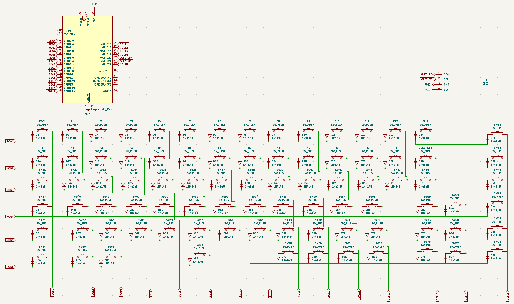
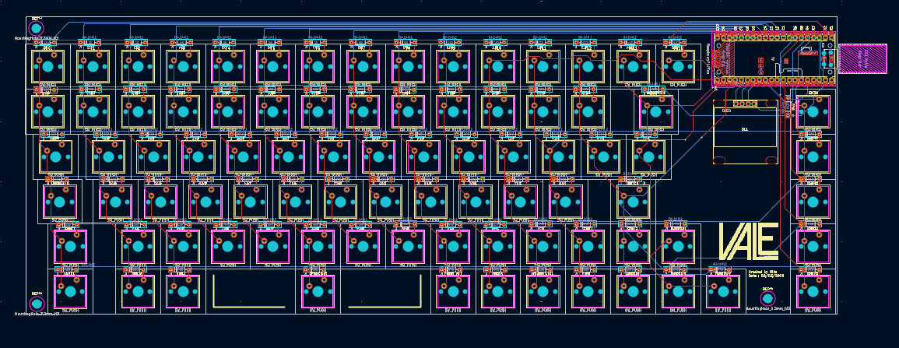

The second in the Brick series. Although this one is called a slab cause it's way larger than the other Brick devices.

# Clicky Slab
## The big brother of the [clicky-brick](https://github.com/sysangl/clicky-brick)

A custom keyboard that would probably cause a house fire.

## Why did I make this?
I was bored, and I needed to fix my current keyboard.

## Features
This is a 86-key keyboard, which should have at least 4KRO, using KMK on a Raspberry Pi Pico. The case and keycaps are 3D printed.
It contains all the keys on a normal keyboard without a numpad and the PRINT_SCREEN key. There are an additional 5 keys on the right hand side that can be customised to do whatever you want. By default these would control the KMK keyboard layers.

# Showcase
- PCB designed in KiCad
- Case designed in FreeCAD
- Handsoldered

# BOM
- 86x Cherry MX Switches
- 86x 1N4148 Diodes DO-35
- 86x MX Keycaps (You probably would need to 3D print them, because I randomly placed the switches :D. Would recommend a resin print to get the best feeling results)
- 1x Raspberry Pi Pico RP2040 MCU
- 1x 0.96" 192x64px OLED Display (Any Colour, I use white)
- 1x Custom Printed PCB (Gerber files are in the releases section. I use JLCPCB to manufacture my PCBs)
- 1x 3D Printed Case (Files are in the releases section)
- 3x M3 Screws
- 3x Brass Heat-Set Inserts
